# MSSE642
## Hands on Assignment #1: Pen Testing Lab Setup

**Erik C. Boozell**

---

## Part 1: Git Bash

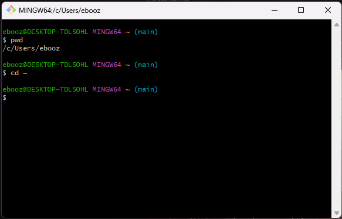

## Part 2: Vagrant

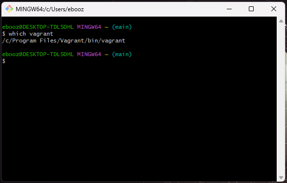

## Part 3: Oracle Virtual Box

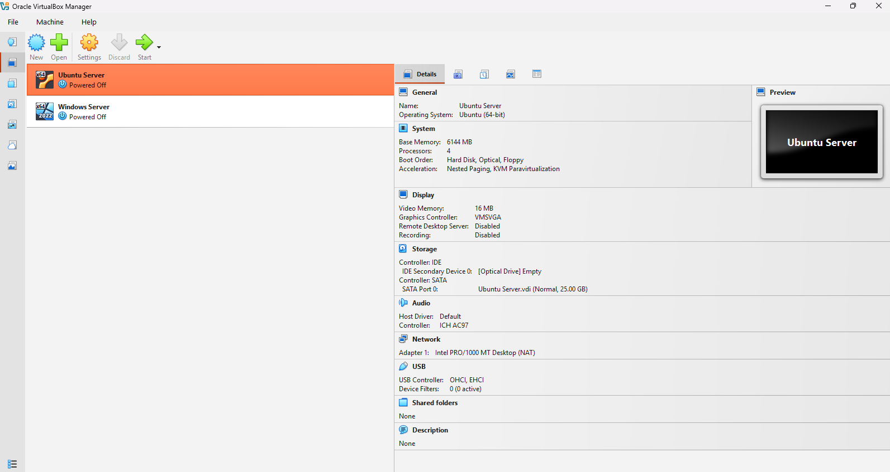

## Part 4: Vagrant Install

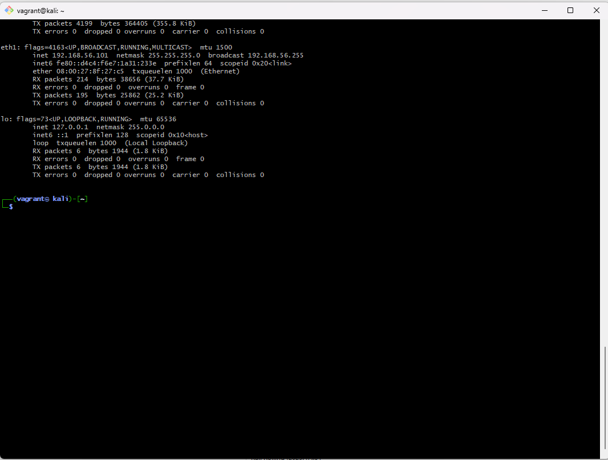
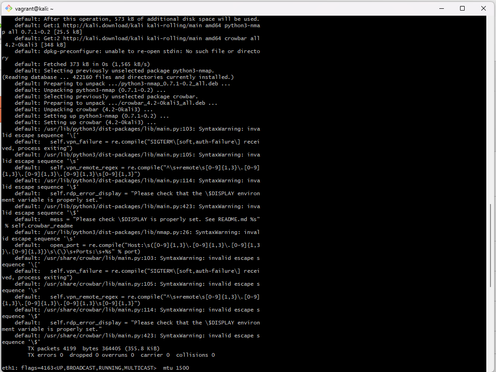 
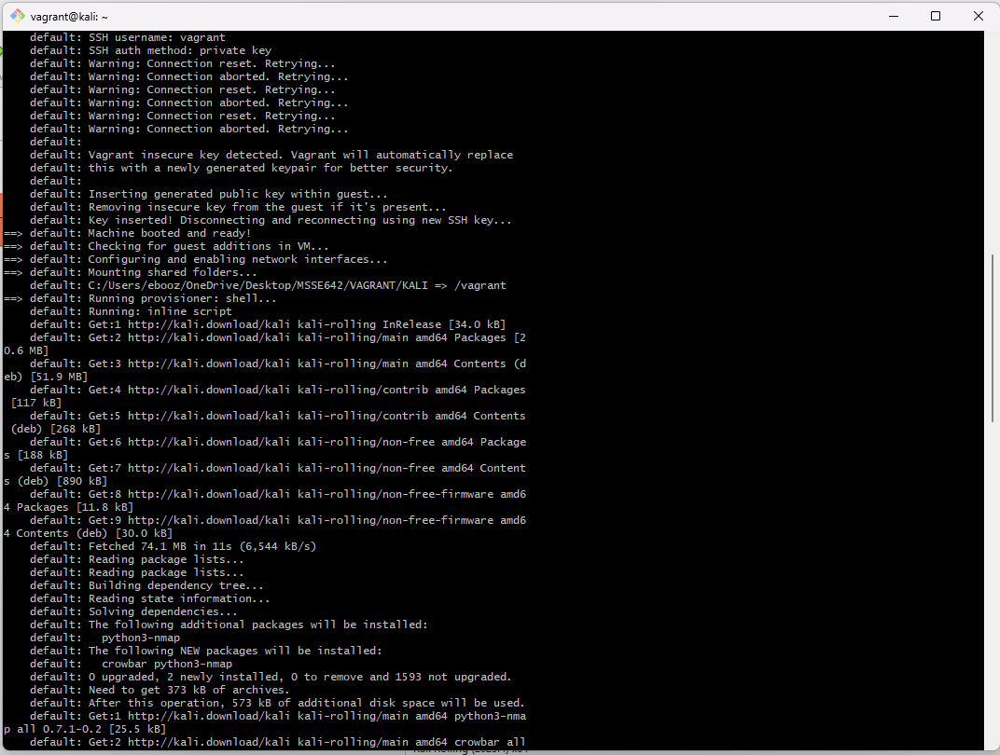 
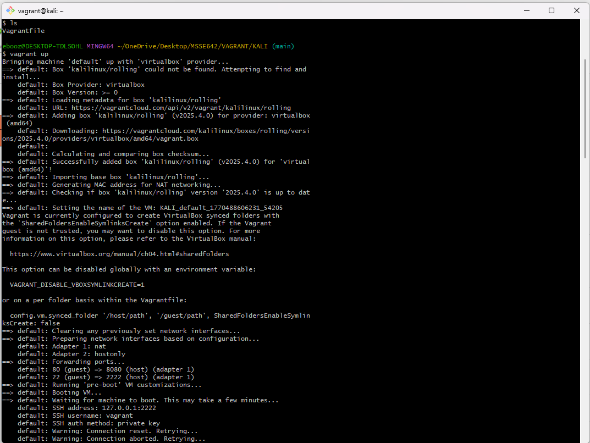 
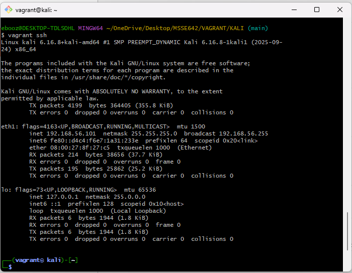

## Part 5: Kali Running

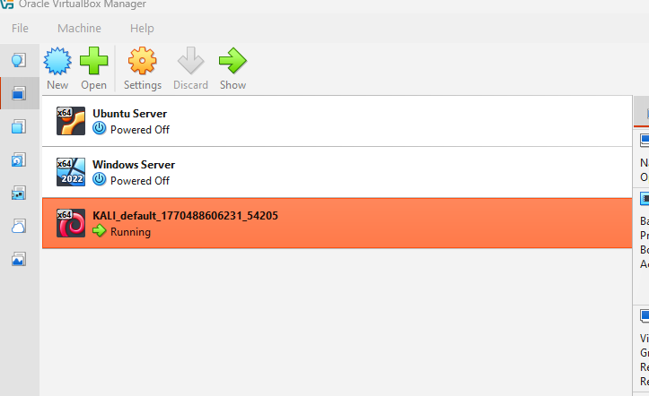

## Part 6: Logged into Kali

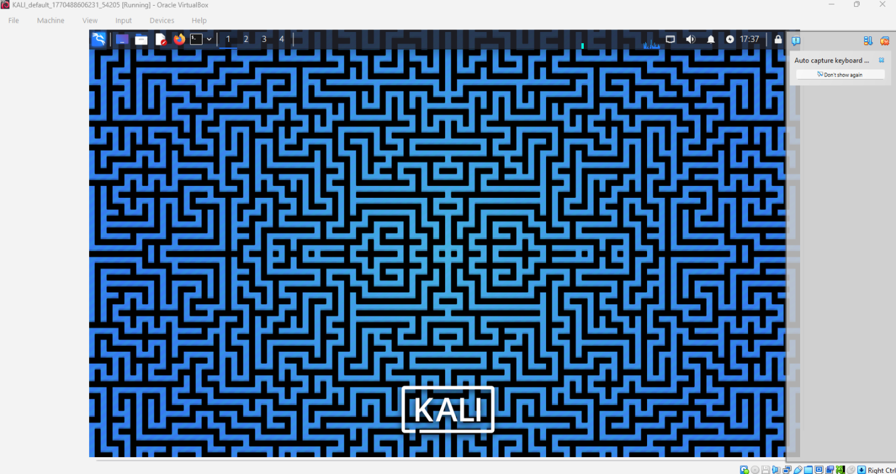

## Part 7: Logged into Metasploitable

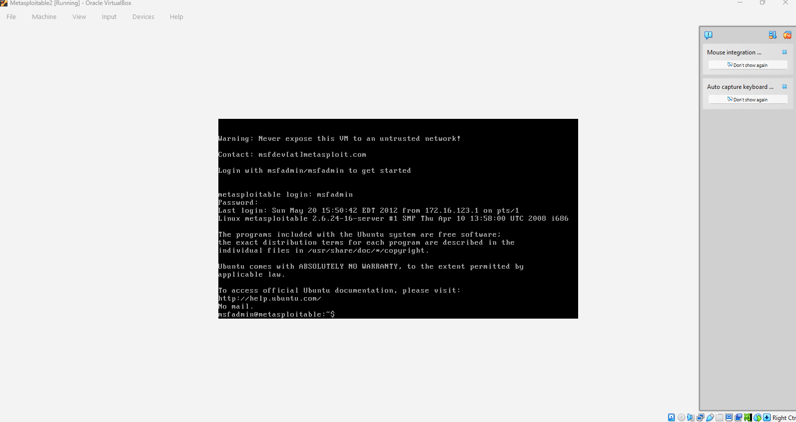
