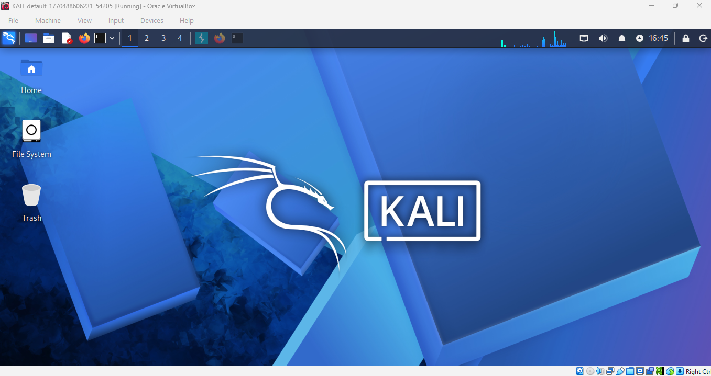
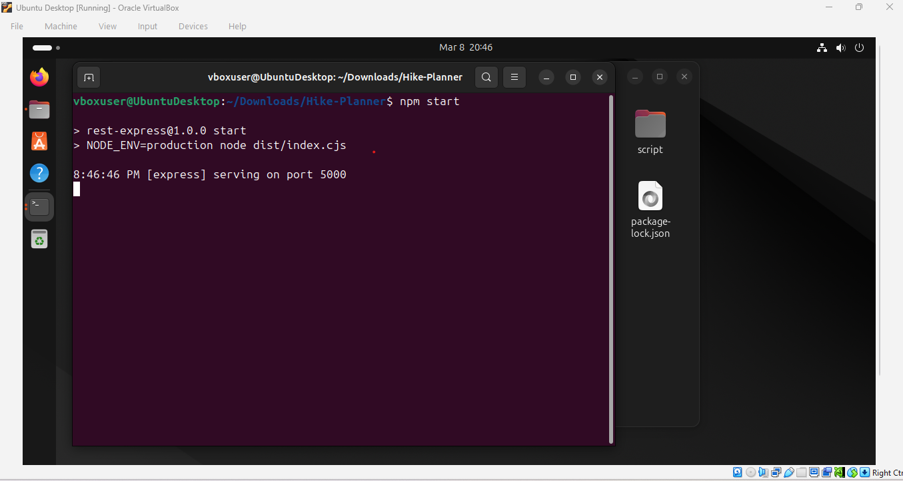
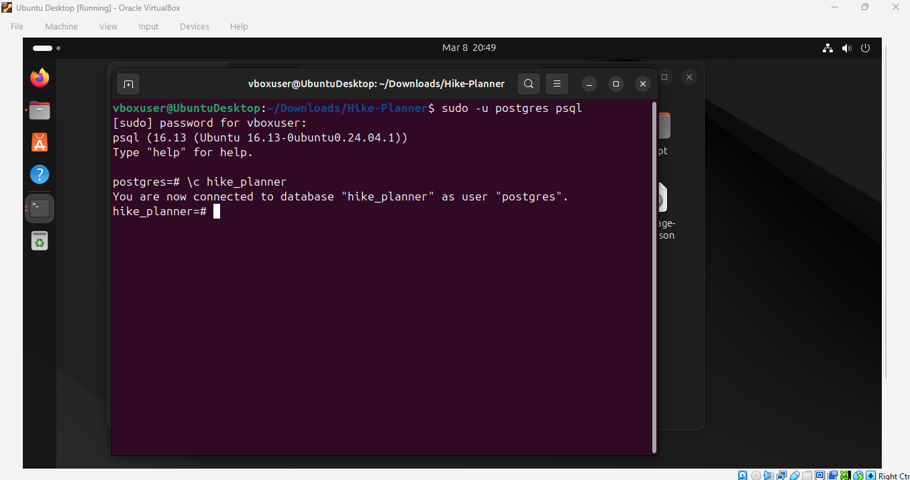
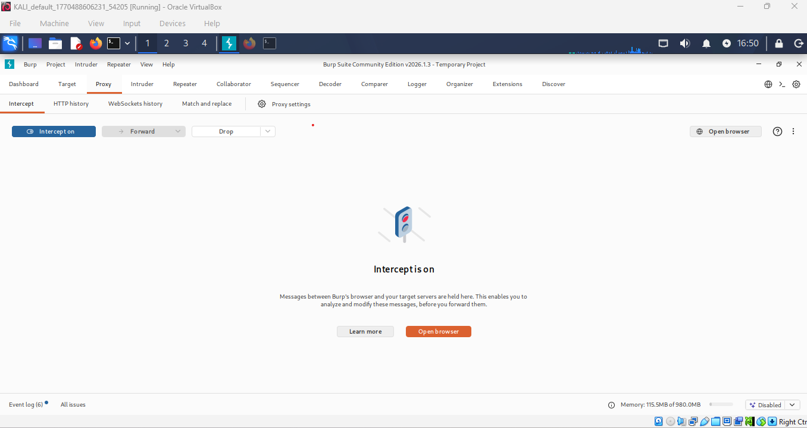
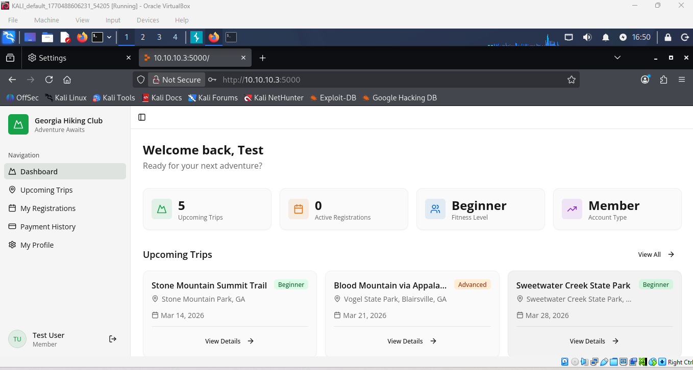
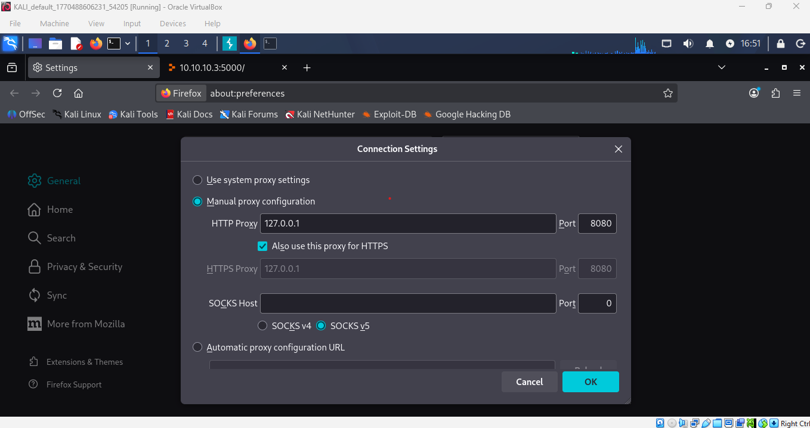
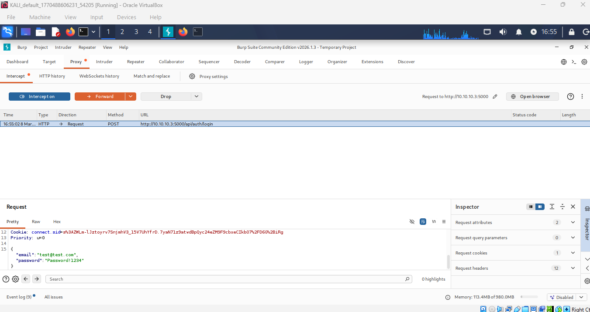
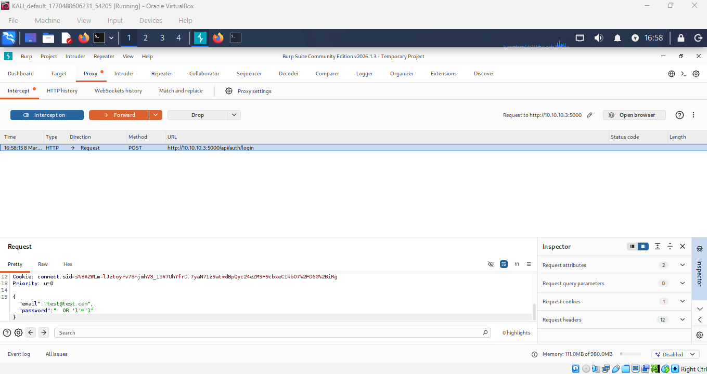
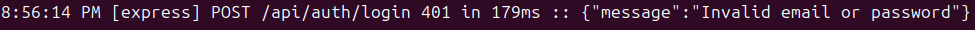
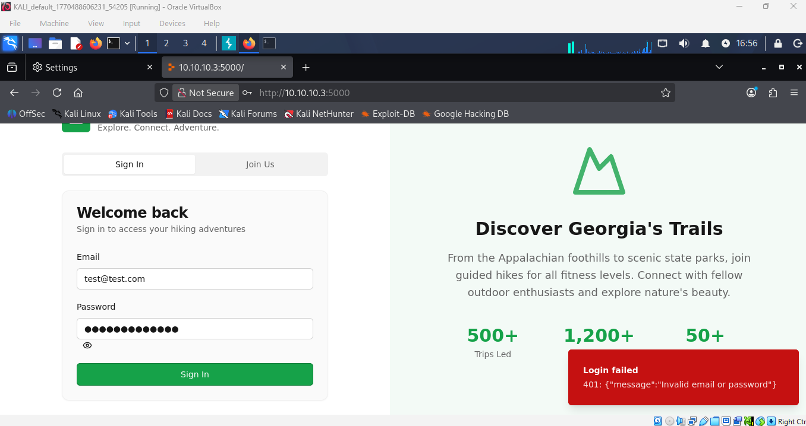

# MSSE 642 – Software Assurance

## Assignment 4 – Penetration Testing

### Introduction

For this assignment I used Burp Suite, a widely used web application security testing platform developed by PortSwigger. Burp Suite allows penetration testers and security professionals to analyze and manipulate HTTP traffic between a web browser and a web server. It works as an intercepting proxy that captures requests and responses, allowing testers to inspect and modify them before they reach the application.

Burp Suite provides several tools that assist with identifying vulnerabilities in web applications. These include the Proxy tool for intercepting traffic, Repeater for resending and modifying requests, Intruder for automated attack testing, and Decoder for analyzing encoded data. Security professionals use Burp Suite to test applications for common vulnerabilities such as SQL injection, cross-site scripting (XSS), authentication flaws, and insecure input validation.

Burp Suite is one of the most commonly used tools in professional penetration testing environments and is included in many security-focused Linux distributions such as Kali Linux.

### Big Picture – Role in the Penetration Testing Process

Burp Suite is primarily used during the web application testing phase of penetration testing. In the standard penetration testing lifecycle, the tool fits into several stages:

- **Information Gathering**  
  Burp Suite can passively collect information about web application endpoints, parameters, and API calls by observing browser traffic.

- **Vulnerability Identification**  
  By intercepting requests and modifying parameters, testers can evaluate how the application handles unexpected or malicious input.

- **Exploitation Testing**  
  Tools such as Repeater and Intruder allow testers to repeatedly send modified requests to determine whether vulnerabilities can be exploited.

Because most modern applications rely heavily on web interfaces and APIs, tools like Burp Suite are essential for identifying security weaknesses in the communication between users and the application backend.

### Lab Environment and Testing

For this lab I tested a Hiking Club web application running in a virtual lab environment.

The environment consisted of:

- Kali Linux VM used as the penetration testing system

- Ubuntu VM hosting the Hiking Club Node.js web application

- PostgreSQL database used by the application

- Burp Suite Community Edition for intercepting HTTP traffic

The Ubuntu system hosted the application on:

`http://10.10.10.3:5000`

Burp Suite was configured as a proxy by setting the browser proxy to:

`127.0.0.1:8080`

This allowed Burp Suite to intercept all HTTP requests sent by the browser.

### Intercepting HTTP Requests

Using Burp Suite's Proxy Intercept feature, I captured HTTP requests sent from the browser to the web application server. When visiting the login page, Burp intercepted the following request:

`POST /api/auth/login`

This request contained login credentials submitted by the user.

### Input Manipulation Testing

After capturing the request, I modified the password parameter to test how the application handled malicious input.

**Original request:**

- Username = test@test.com
- Password = Password!1234

**Modified request:**

- Password = ' OR '1'='1

This payload is a common SQL injection test designed to evaluate whether the application properly sanitizes user input before sending it to the database.

After modifying the request in Burp Suite, I forwarded it to the server and observed the server response. The server returned an error message indicating that the input was not a valid password. This response suggested that the application detected the abnormal input or failed to process it correctly.

### Conclusion

Burp Suite proved to be a powerful tool for testing the security of web applications. By acting as an intercepting proxy between the browser and the server, it allows testers to observe and manipulate HTTP traffic in real time. This capability makes it possible to test how applications respond to unexpected input and to identify potential vulnerabilities.

In this lab, Burp Suite was used to intercept authentication requests from the Hiking Club application and modify the parameters to simulate potential attacks such as SQL injection. Although the application did not appear to allow successful exploitation, the testing process demonstrated how penetration testers evaluate web application security.

Understanding how to use tools like Burp Suite is an important skill for software engineers and cybersecurity professionals because it helps developers identify weaknesses in applications before attackers can exploit them.

### References

- Singh, Glen. *Learn Kali Linux 2019*. Packt Publishing.
- PortSwigger. Burp Suite Documentation. https://portswigger.net/burp
- OWASP Foundation. Web Security Testing Guide. https://owasp.org

